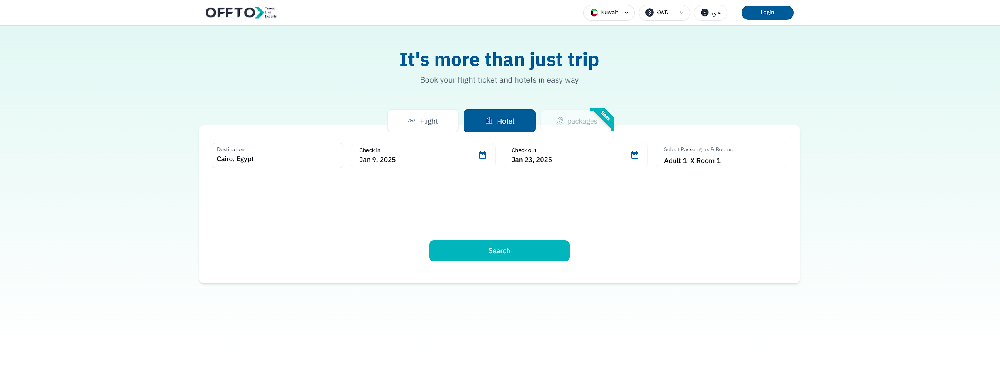

# Frontend Engineer Role assessment for OFFTO

## Objective:
The assessment is to build a frontend UI that replicates the provided design and integrates with specific APIs for destinations and hotel search functionality.

---

## Phase 1: Localization and Internationalization

### Requirements:
#### Localization Support
1. **Integration with `next-intl`**
   - Use the [next-intl](https://next-intl.dev/) package to add support for multiple languages.
   - Ensure the project supports at least two languages (e.g., English and Arabic).

2. **Translation Files**
   - Store translations in separate JSON files for each language.
   - Key translations required:
     - UI labels and buttons (e.g., "Destination", "Check-In Date", "Check-Out Date").
     - Error messages.
     - Placeholder texts.

3. **Language Switcher**
   - Add a language switcher dropdown to the top-right corner of the application.
   - Ensure the UI updates dynamically based on the selected language.

4. **Responsive Text Direction**
   - Implement RTL (right-to-left) support for languages like Arabic.

5. **Testing Localization**
   - Verify that all UI components and content adapt correctly to the selected language and direction.

---

## Phase 2: UI and Initial API Integration

### Requirements:
#### UI Components
1. **Destination Input**
   - A text input box where users can type the name of a city.
   - A search button next to it that triggers the destination search API.

2. **Check-In and Check-Out Dates**
   - Two date pickers for selecting the check-in and check-out dates.

3. **Passengers and Rooms Selection**
   - A dropdown that allows users to:
     - Add up to 6 rooms.
     - For each room, specify:
       - Number of adults.
       - Number of children.
       - Ages of children.
       - Number of infants.

4. **Search Button**
   - A button to send the final hotel search request based on user input.

5. **Search Inputs Transition:**
   - After entering the destination, dates, and passenger details, the search inputs will function on a second screen as shown in the design.

6. **Header and Background**
   - Build the header with a language switcher matching the design.
   - Ensure the background includes the linear gradient and text as provided in the screens.

### API Integration
#### Endpoint 1: Get All Cities
- **URL:** `{{base_url}}/get_all_cities`
- **Method:** POST
- **Request Body:**
  ```json
  {
      "search": "name_of_city"
  }
  ```
- **Response:** A list of matching cities.
- **Task:** Use this endpoint to search for cities. When a city is selected, it should populate the "Destination" field.

#### Endpoint 2: Get All Hotels
- **URL:** `{{base_url}}/get_all_hotels?page=1`
- **Method:** POST
- **Request Body Example:**
  ```json
  {
      "DestinationCity": "Dubai",
      "CheckInDate": "2024-04-25",
      "CheckOutDate": "2024-04-29",
      "CountryofResidence": "KW",
      "CountryOfNationality": "KW",
      "Room": [
          {
              "NumberOfAdult": 2,
              "NumberOfChild": 1,
              "AgeOfChild": [9]
          }
      ],
      "currencyCode": "KWD",
      "locale": "en"
  }
  ```
- **Response:** A list of hotels matching the search criteria.
- **Task:** Use this endpoint to fetch the hotel list based on:
  - Selected destination.
  - Check-in and check-out dates.
  - Passengers and room information.
  - Ensure that the search button reflects the loading status of the request. Once the response is received, the button should stop indicating the loading state. Additionally, confirm that the data originates from the backend by verifying it in the network tab.

### Functional Requirements
1. **Destination Search**
   - As the user types, make a POST request to the "Get All Cities" endpoint.
   - Display the results in a dropdown.
   - Allow the user to select a city from the dropdown.

2. **Room and Passenger Selection**
   - Implement functionality to add up to 6 rooms.
   - For each room:
     - Allow the user to select the number of adults, children, and infants.
     - If children are added, prompt the user to input their ages.

3. **Search Functionality**
   - Gather all inputs (destination, check-in and check-out dates, rooms, and passengers).
   - Construct a POST request to the "Get All Hotels" endpoint.
   - Display the list of hotels returned in the response.

4. **Design Consistency**
   - Ensure the UI components match the design provided in the attached screens.

---

## Deliverables
1. Source code for the UI.
2. A working prototype of the interface.
3. README file with setup instructions and any assumptions made.

---

## Evaluation Criteria
- UI similarity to the design.
- Proper integration with APIs.
- Code structure and readability.
- Handling edge cases and errors.
- Clear documentation.


## Screens




